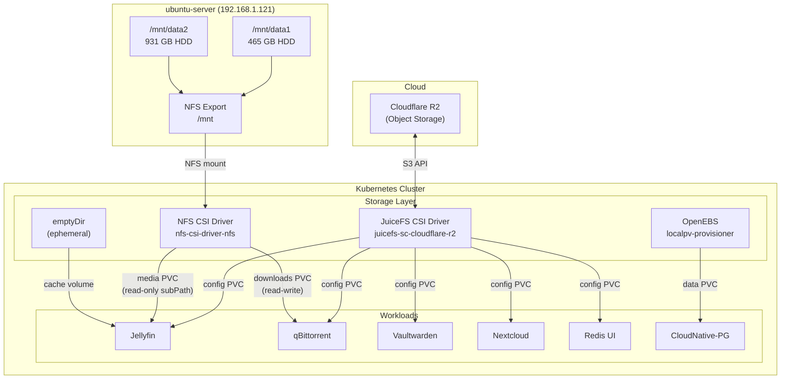
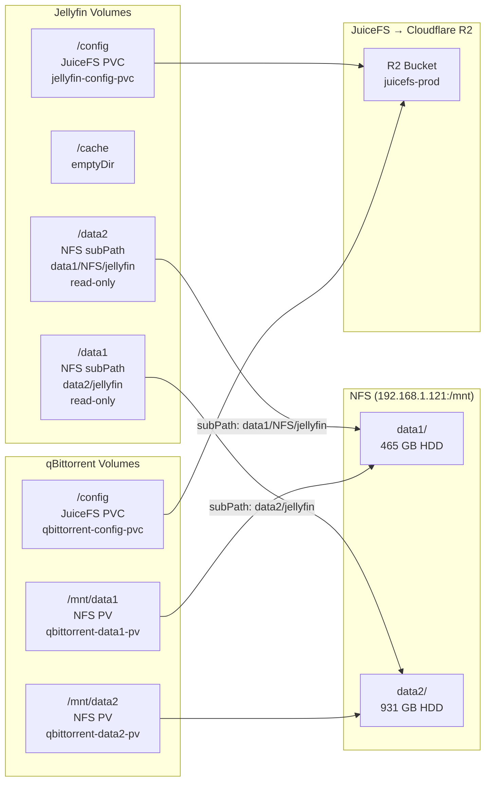

# Home Lab Infrastructure

> *"Move fast and break things"* -- Mark Zuckerberg
> *"I moved fast. Things are broken."* -- Me, at 3 AM

Private infrastructure repository managing a single-node Proxmox environment that somehow runs production services, a Kubernetes cluster held together by optimism, and more YAML than any human should write in one lifetime.

**Domain:** `datrollout.dev`

---

## Table of Contents

- [Architecture Overview](#architecture-overview)
- [Hardware](#hardware)
- [Network Topology](#network-topology)
- [Compute Inventory](#compute-inventory)
- [Platform Tooling](#platform-tooling)
- [Deployed Services](#deployed-services)
- [The Kubernetes Situation](#the-kubernetes-situation)
- [War Stories (Incidents)](#war-stories-incidents)
- [Storage Architecture](#storage-architecture)
- [Security](#security)
- [Observability](#observability)
- [Backup and Disaster Recovery](#backup-and-disaster-recovery)
- [CI/CD](#cicd)
- [Repository Structure](#repository-structure)
- [Getting Started](#getting-started)

---

## Architecture Overview

The infrastructure follows a hybrid model in active transition: services are being migrated from Docker on ubuntu-server to Kubernetes, starting with internal tools. Kubernetes is no longer just a lab — it is increasingly the primary runtime, while Docker remains the fallback for anything not yet migrated.

```
                         Internet
                            |
                      "please be gentle"
                            |
                            v
                  +-------------------+
                  |    Cloudflare     |
                  | DNS / WAF / Proxy |
                  |  "the bodyguard"  |
                  +---------+---------+
                            |
                            v
+---------------------------------------------------------------+
|                   Proxmox VE (pve-master)                     |
|                     192.168.1.120                              |
|              One node to rule them all.                        |
|                                                                |
|  PRODUCTION (the stuff that must not go down)                  |
|  +----------------------------------------------------------+  |
|  | ubuntu-server  .1.121                                    |  |
|  | Traefik, Docker services, Monitoring stack               |  |
|  | GitLab, Agent DVR                  (the workhorse)       |  |
|  +----------------------------------------------------------+  |
|  +---------------------------+  +---------------------------+  |
|  | vpn-server     .1.123     |  | teleport       .1.122     |  |
|  | OpenVPN + OTP             |  | Zero-Trust Access         |  |
|  +---------------------------+  +---------------------------+  |
|                                                                |
|  (No more LXC. The postgresql-16 container was evicted;        |
|   CNPG in K8s does its job now and holds no grudges.)          |
|                                                                |
|  Kubernetes Cluster (PRODUCTION — migration in progress)      |
|  +----------------------------------------------------------+ |
|  | Masters: .1.180-.182 (x3)  Workers: .1.190-.192 (x3)     | |
|  | 13 vCPU / 13 GB RAM / 250 GB disk per worker (production) | |
|  | ArgoCD, Traefik, MetalLB, OpenEBS, CloudNative-PG,       | |
|  | Velero, kube-prometheus-stack, Loki, Alloy,              | |
|  | qBittorrent, Jellyfin, Vaultwarden, Nextcloud, SonarQube | |
|  | CrowdSec (WAF/IDS), Argus (SRE assistant, active dev)    | |
|  | "One day this will replace everything above.             | |
|  |  That day has started. And it's tagged production."       | |
|  +----------------------------------------------------------+ |
+---------------------------------------------------------------+
```

Traffic flow for public-facing services:

```
Client -> Cloudflare (proxy/WAF) -> Traefik (reverse proxy) -> CrowdSec (middleware) -> Service
                                                                     |
                                                              "papers, please"
```

A maintenance-mode override is available via a Cloudflare Workers-hosted page and a Cloudflare page rule, managed by the scripts in [`maintainPage/`](#maintainpage---cloudflare-maintenance-mode).

---

## Hardware

One server. Everything runs on one server. Yes, the "cluster" too. No, it's not HA. Yes, I know.

| Component      | Specification                          | Notes                              |
|----------------|----------------------------------------|------------------------------------|
| CPU            | 2x Intel Xeon E5-2680 v4 (56 threads) | Slightly aged but still kicking    |
| Memory         | 62 GB DDR4                             | Enough for K8s. Barely.            |
| Boot/VM disk   | 1.8 TB NVMe                            | The fast one. VMs live here.       |
| Data (HDD)     | 465 GB + 931 GB SATA                   | Spinning rust from a previous era  |
| Hypervisor     | Proxmox VE                             | The backbone of this operation     |
| Electricity    | Yes                                    | I don't talk about this           |

---

## Network Topology

| Network              | Subnet             | Purpose                              |
|----------------------|---------------------|--------------------------------------|
| LAN                  | 192.168.1.0/24     | Primary network for all VMs and LXCs |
| Private              | 192.168.99.0/24    | Isolated network for stateful LXCs -- now unused since the postgresql-16 LXC was removed, but kept around for the next thing that needs to hide from the outside |
| Docker internal      | 192.168.30.0/24    | Bridge network for Docker containers on ubuntu-server |
| MetalLB pool         | 192.168.1.230-240  | Kubernetes LoadBalancer IP range     |

DNS is managed via Cloudflare and Terraform.

**Public DNS (proxied CNAME via Cloudflare):**

| Record                          | Type  | Proxied | Target        |
|---------------------------------|-------|---------|---------------|
| gitlab.datrollout.dev           | CNAME | Yes     | DDNS endpoint |
| bitwarden.datrollout.dev        | CNAME | Yes     | DDNS endpoint |
| sonarqube.datrollout.dev        | CNAME | Yes     | DDNS endpoint |
| nextcloud.datrollout.dev        | CNAME | Yes     | DDNS endpoint |
| loki.datrollout.dev             | CNAME | Yes     | DDNS endpoint ¹ |
| prometheus.datrollout.dev       | CNAME | Yes     | DDNS endpoint ¹ |
| grafana.datrollout.dev          | CNAME | Yes     | DDNS endpoint ¹ |

> ¹ `loki`, `prometheus`, and `grafana` DNS records are managed manually (not in Terraform). They are routed via Traefik on ubuntu-server to Docker-hosted services.

**Direct-to-Traefik DNS (unproxied A records pointing to K8s Traefik at `192.168.1.232`):**

| Record                          | Type | Proxied | Target          |
|---------------------------------|------|---------|-----------------|
| jellyfin.datrollout.dev         | A    | No      | 192.168.1.232   |
| core-harbor.datrollout.dev      | A    | No      | 192.168.1.232   |
| kafka-ui.datrollout.dev         | A    | No      | 192.168.1.232   |
| pgadmin4.datrollout.dev         | A    | No      | 192.168.1.232   |
| argocd.datrollout.dev           | A    | No      | 192.168.1.232   |
| qbittorrent.datrollout.dev      | A    | No      | 192.168.1.232   |

Direct records resolve to the Kubernetes Traefik ingress (via MetalLB). Media-heavy services such as Jellyfin stay DNS-only to avoid Cloudflare media bandwidth limits and are protected at Traefik with CrowdSec.

---

## Compute Inventory

### Virtual Machines

| Host           | IP             | OS           | vCPU | RAM   | Role                                 |
|----------------|----------------|--------------|------|-------|--------------------------------------|
| pve-master     | 192.168.1.120  | Proxmox VE   | --   | --    | Hypervisor (the boss)                |
| ubuntu-server  | 192.168.1.121  | Ubuntu 22.04 | 4    | 8 GB  | Docker host, Traefik, monitoring (the workhorse) |
| teleport       | 192.168.1.122  | --           | --   | --    | Zero-trust access proxy              |
| vpn-server     | 192.168.1.123  | Debian 13    | 1    | 2 GB  | OpenVPN with OTP (for remote chaos)  |

#### Decommissioned VMs

| Host           | IP             | OS           | Notes                                     |
|----------------|----------------|--------------|-------------------------------------------|
| hephaestus     | 192.168.1.124  | --           | Decommissioned 2026-04-27. Former self-hosted GitLab/GitHub runner. |

### LXC Containers

None. The lone `postgresql-16` LXC (`192.168.99.2`) was **removed** — production PostgreSQL now lives on CloudNative-PG in K8s, and the Terraform config no longer defines any LXC at all. Everything on Proxmox is a VM now.

### Kubernetes Cluster (Production)

Deployed via Kubespray (currently **v1.34.3**) and managed by ArgoCD app-of-apps. The repository currently includes a local Kubespray inventory under `ansible/kubernetes/kubespray/inventory/local/hosts.ini`; actual production node sizing/count may differ from this local inventory snapshot. See [The Kubernetes Situation](#the-kubernetes-situation) for migration status.

| Role    | Count | IP Range            | vCPU | RAM   | Disk   |
|---------|-------|---------------------|------|-------|--------|
| Master  | 3     | 192.168.1.180-182   | 2    | 6 GB  | 50 GB  |
| Worker  | 3     | 192.168.1.190-192   | 13   | 13 GB | 250 GB |

---

## Platform Tooling

### Terraform

All infrastructure provisioning is managed through Terraform with reusable modules from a separate [terraform-module](https://github.com/ngodat0103/terraform-module) repository. Because copy-pasting HCL blocks is for people who haven't been hurt enough yet.

| Configuration           | Provider                  | Purpose                                       |
|-------------------------|---------------------------|-----------------------------------------------|
| `tf/proxmox`            | bpg/proxmox 0.92.0       | VMs, LXCs, networks, cloud-init images        |
| `tf/cloudflare/dns`     | cloudflare/cloudflare ~5  | DNS records, WAF firewall rules               |
| `tf/cloudflare/storage` | cloudflare/cloudflare     | R2 object storage (Velero backend)            |
| `tf/uptimerobot`        | vexxhost/uptimerobot      | External uptime monitoring (the 3 AM alarm)   |
| `tf/openstack`          | openstack provider        | OpenStack resource provisioning               |

### Ansible

Server configuration and application deployment for all non-Kubernetes workloads. The production stuff. The things that actually matter.

| Playbook Area                | Purpose                                               |
|------------------------------|-------------------------------------------------------|
| `ansible/core/ubuntu-server` | Docker host setup, app deployment, monitoring, cron   |
| `ansible/core/teleport`      | Teleport access proxy installation                    |
| `ansible/core/vpn-server`    | OpenVPN server with OTP                               |
| `ansible/kubernetes`          | Kubespray inventory and cluster configuration         |
| `ansible/kubernetes/rbac`    | Teleport RBAC configuration for Kubernetes            |
| `ansible/proxmox`            | Proxmox host configuration (GRUB, power, firewall)   |

Legacy configurations from the old bare-metal era are preserved in `ansible/old-bare-metal/` for reference.

### ArgoCD (Kubernetes)

GitOps deployment uses an app-of-apps chart at `kubernetes/argocd/app-of-app`. Feature toggles in `values.yaml` are the source of truth for what is active.

**Enabled apps right now (`values.yaml`):**
- `metallb`, `traefik`, `openebs`, `postgresql`, `velero`, `kubePrometheusStack`
- `customManifest`, `loki`, `alloy`, `pgadmin4`, `sonarqube`
- `juicefs`, `vaultwarden`, `nextcloud`, `certManager`, `nfsCsiDriver`
- `qbittorrent`, `jellyfin`, `argus`, `crowdsec`

**Disabled right now:**
- `mongoOperator`, `kafkaOperator`, `harbor`, `redis`, `agentDvr`

---

## Deployed Services

### Production (Docker on ubuntu-server)

Services still on Docker. GitLab migration is pending / possibly aborted due to complexity.

| Service       | Purpose                  | Exposed Domain              | Status        |
|---------------|--------------------------|-----------------------------|---------------|
| GitLab        | Source control and CI/CD | gitlab.datrollout.dev       | Docker (migration pending/aborted) |
| Vaultwarden   | Password management      | bitwarden.datrollout.dev    | **Migrated → K8s** |
| Nextcloud     | File synchronization     | nextcloud.datrollout.dev    | **Migrated → K8s** |
| Jellyfin      | Media server             | jellyfin.datrollout.dev     | **Migrated → K8s** |
| qBittorrent   | Torrent client           | qbittorrent.datrollout.dev  | **Migrated → K8s** |
| Agent DVR     | Camera/NVR               | `http://<ubuntu-server>:8090` | Docker (rolled back from K8s, May 2026) |

> K8s manifests for Agent DVR exist (`argocd-app/stateful/agent-dvr/`) but are currently disabled (`agentDvr.enabled: false`). When re-enabled, it uses a direct `LoadBalancer` service exposing: Web UI `8090/TCP`, TURN `3478/TCP+UDP`, relay `50000-50100/UDP`.

### Production (Standalone)

| Service       | Host             | Purpose                           |
|---------------|------------------|-----------------------------------|
| Teleport      | 192.168.1.122    | Zero-trust infrastructure access  |
| OpenVPN       | 192.168.1.123    | Remote VPN access with OTP        |

> The standalone `postgresql-16` LXC (`192.168.99.2`) has been **removed** (Terraform config dropped in `fad73ce`). Production PostgreSQL now runs on CloudNative-PG in the Kubernetes cluster, with continuous WAL archiving to Cloudflare R2 (see [Backup and Disaster Recovery](#backup-and-disaster-recovery)).

### Kubernetes Cluster (Production GitOps)

The cluster runtime is production-oriented, with staged migration from Docker workloads. Current app-of-app managed services:

| Application Group       | Active Components |
|-------------------------|-------------------|
| Ingress / L4 networking | Traefik, MetalLB |
| Platform / storage      | OpenEBS, JuiceFS, NFS CSI Driver, Velero |
| Observability           | kube-prometheus-stack, Loki, Alloy |
| Data / app platform     | CloudNative-PG, cert-manager, pgadmin4 |
| User services           | Vaultwarden, Nextcloud, SonarQube, qBittorrent, Jellyfin |
| Security                | CrowdSec (LAPI + AppSec, Helm chart 0.24.0) |
| SRE / automation        | Argus (intelligent SRE assistant — K8s incident response and workload management; active development) |
| Misc                    | custom-manifest |

Traefik and Vaultwarden now run **2 replicas** for HA, backed by `ReadWriteMany` JuiceFS volumes so multiple pods can share state without fighting over the mount.

ArgoCD and chart versions evolve over time; use `kubernetes/argocd/app-of-app/templates/*.yaml` and app-specific values files as the canonical source for current revisions.

CloudNative-PG manages databases for: `nextcloud`, `gitlabhq_production`, `vaultwarden`.

---

## The Kubernetes Situation

The migration has started. Here is the honest state of affairs.

The Kubernetes cluster started as a **dev and exploration environment** and has been promoted to `production`. Production ran on Docker + Ansible on ubuntu-server because it worked and I slept at night. That model is now actively being dismantled.

Every service on the Docker side requires writing Ansible playbooks, Docker Compose files, systemd units, Traefik labels, Prometheus scrape configs, backup cron jobs, and update procedures — **per service, by hand, every single time**. It's the YAML equivalent of digging a ditch with a spoon. Kubernetes solves this: define it once, let ArgoCD sync it, let the platform handle scheduling, networking, storage, secrets, and rollbacks. The app-of-apps pattern already proves the point — enabling a full service stack is a boolean flip in `values.yaml`.

**Migration strategy: internal tools first.**

Internal-facing services (no public exposure, no user-facing SLA) are migrated first to build confidence in the cluster before touching anything critical.

| Wave | Services | Status |
|------|----------|--------|
| 1 — Internal tools | qBittorrent, Jellyfin | **Done** |
| 1b — Rolled back | Agent DVR | Reverted to Docker (May 2026) — K8s manifests exist but disabled |
| 2 — Self-hosted productivity | Nextcloud, Vaultwarden | **Done** |
| 3 — Critical infrastructure | GitLab | Pending / Aborted |

**Storage approach for migrated services:**
- Config / state (selected apps) → JuiceFS backed by Cloudflare R2
- Media / large data → static NFS PV/PVC on `ubuntu-server` exports
- Database state → OpenEBS local PV (CloudNative-PG)
- Ephemeral cache/temp → `emptyDir` where appropriate

**The plan:**

1. ~~Keep exploring and stabilizing the K8s environment~~ — done, it runs workloads
2. ~~Prove it can run workloads reliably~~ — qBittorrent and Jellyfin are live
3. ~~Continue migrating internal tools wave by wave~~ — Nextcloud and Vaultwarden are live
4. When budget allows, build a proper multi-node cluster with dedicated hardware
5. Eventually decommission ubuntu-server as a Docker host entirely

The cluster now runs production workloads.

---

## War Stories (Incidents)

> *"It works on day 1."* — Every flag I never flipped again.

Production means production incidents. We log them here so I can pretend I learned something.

### INCIDENT-0: The Great Kubespray Civil War (2026-06-21)

**Duration:** 1h 18m of downtime | **Blast radius:** Nextcloud, Vaultwarden, qBittorrent, Jellyfin, ArgoCD, Traefik, MetalLB | **Body count:** my evening.

I upgraded the cluster Kubernetes version with Kubespray. What could go wrong? Everything. Everything could go wrong.

**The plot:** Back on day 1, I let Kubespray bootstrap ArgoCD, Traefik, and MetalLB with `_enabled: true`. Then I quietly migrated all three to my own Helm/GitOps stack and *never flipped the flags back*. For months, two owners co-existed in blissful denial. The next `cluster.yml` run woke them both up at once, and they immediately started fist-fighting over who owns which resource:

```
Error: UPGRADE FAILED: conflict occurred while applying object ...
conflict with "kubectl-client-side-apply" using v1 ...
```

That's the sound of `kubectl-client-side-apply` (Kubespray) and my Helm server-side-apply both grabbing the same wheel. MetalLB speakers got stuck `Pending` because two installs tried to bind the same `hostPort` (turns out `hostPort` is a node-level singleton — who knew, besides everyone). Traefik went down, so Nextcloud started returning connection timeouts to the family. ArgoCD CrashLooped on duplicate pods, which is delightful because ArgoCD was supposed to be the thing fixing everything.

**The near-death experience:** To restart the broken ArgoCD I deleted the `Application` CRs — forgetting they carried `resources-finalizer.argocd.argoproj.io`, a.k.a. *the "cascade-delete everything I manage, including your PVCs" finalizer*. So I personally instructed the cluster to nuke qBittorrent's and Jellyfin's PVCs. It complied. Enthusiastically.

**Why I still have a job (with myself):** every stateful PV was set to `Retain`, not `Delete`. The PVs survived as orphaned `Released` volumes with the data intact on disk. A `claimRef` patch + PVC re-bind later, everyone came back from the dead. CNPG escaped untouched because its auto-sync was fully disabled and it manages its own PVCs. Luck, dressed up as architecture.

**One-line root cause:** a single stale `=true` flag set at bootstrap and never flipped. That's it. That's the incident.

**Lessons, abbreviated:**
- Bootstrap flags are temporary scaffolding, not permanent config. Flip them in the *same* change you GitOps-ify a component.
- Pick ONE deployer per component. Kubespray **or** Helm. Never both. They do not share custody amicably.
- `Retain` reclaim policy is the difference between "annoying afternoon" and "permanent data loss." Use it on every stateful PV.
- The ArgoCD finalizer cascade-deletes everything. Strip the finalizer *before* deleting any Application that manages stateful workloads.
- Audit all enabled addons in one pass before upgrading instead of playing whack-a-mole three times in a row (ArgoCD → Traefik → MetalLB) like I did.

Full postmortem, the PV→PVC rebind procedure, the field-manager (SSA vs CSA) deep-dive, and the pre-upgrade checklist: [`ansible/kubernetes/INCIDENT-0.md`](ansible/kubernetes/INCIDENT-0.md).

---

## Storage Architecture

Three storage tiers are in use — cloud object storage for durable config/state, local NFS for bulk media, and ephemeral node-local storage for throwaway cache.

### Overall Storage Topology



### Per-Workload Storage Mapping



### Storage Tier Summary

| Tier | Technology | Backend | Use Case | Durability |
|------|-----------|---------|----------|------------|
| Cloud-backed config | JuiceFS CSI | Cloudflare R2 | App config, state | Survives node/disk loss |
| Local NFS | NFS CSI Driver | ubuntu-server `/mnt` | Media files, torrent downloads | Single-host (NAS) |
| Ephemeral | `emptyDir` | Node disk | Transcoding cache | Lost on pod restart |
| Local block | OpenEBS localpv | Worker node disk | PostgreSQL data | Single-node |

### Performance Notes

A JuiceFS + R2 high-write diagnosis (see [`findings/juicefs-r2-high-write-report.md`](findings/juicefs-r2-high-write-report.md)) identified that Jellyfin's SQLite WAL flushes during playback generated excessive Class A operations to R2. The fix: adding `upload-delay=3h` mount option to JuiceFS, reducing writes by ~97.5%.

---

## Security

Traffic goes through multiple layers before it reaches anything useful. I'd rather explain downtime than a breach.

### Edge Protection (Cloudflare)

- All public traffic is proxied through Cloudflare
- Geo-blocking: only traffic originating from Vietnam is permitted (sorry, rest of the world)
- UptimeRobot health check IPs are explicitly whitelisted
- Vaultwarden `/admin` endpoint is blocked at the edge, because even I don't trust myself with that URL exposed

### Reverse Proxy (Traefik v3)

- TLS termination via Let's Encrypt using Cloudflare DNS-01 challenge
- All requests pass through CrowdSec bouncer middleware -- every single one
- Real client IPs extracted from `CF-Connecting-IP` header
- Prometheus metrics and structured access logging enabled

### Kubernetes Internal Ingress Policy

Internal-only applications in the Kubernetes cluster stay behind Traefik and are restricted with an IP allowlist middleware.

- Internal-only apps: `sonarqube`, `juicefs`, `grafana`, `alertmanager`, `pgadmin4`, `chaos-mesh`
- Harbor follows the same policy when enabled
- Required ingress annotations for internal apps:
  - `traefik.ingress.kubernetes.io/router.entrypoints: "websecure"`
  - `traefik.ingress.kubernetes.io/router.middlewares: "traefik-allow-local-ip-only@kubernetescrd"`
- Allowed LAN/VPN CIDRs are managed in:
  - `kubernetes/argocd/argocd-app/stateless/traefik/middlewares/allow-local-ip-only.yaml`
- Public apps must not use the local-only middleware

### Intrusion Detection (CrowdSec)

Migrated from a standalone LXC (`192.168.1.127`) to an in-cluster Helm deployment (chart `0.24.0`) managed by ArgoCD. LAPI uses the existing CloudNative-PG PostgreSQL as its backend; Traefik bouncer middleware now routes to the in-cluster Services instead of a static IP.

- LAPI running on port 8080, AppSec engine on port 7422
- Detection scenarios: HTTP path traversal, XSS probing, generic brute force
- Operating mode: live (real-time blocking, not just logging and hoping)
- Failure behavior: **block all traffic** if CrowdSec becomes unreachable

```yaml
crowdsecAppsecUnreachableBlock: true
crowdsecAppsecFailureBlock: true
# Translation: "I'd rather the site be down than compromised"
```

### Access Management

| Tool       | Purpose                                        |
|------------|------------------------------------------------|
| Teleport   | Zero-trust access to SSH and internal services |
| OpenVPN    | Remote network access with OTP                 |

### Secret Management

| Method          | Scope                                  |
|-----------------|----------------------------------------|
| Ansible Vault   | Infrastructure credentials             |
| Kubernetes Secrets / Helm values | In-cluster app secrets and runtime configuration |
| SOPS + Age (Helm values) | Encrypted Helm value files (e.g., `secret.enc.yaml`) decrypted at sync-time via ArgoCD repo-server init containers |

---

## Observability

Everything emits metrics or logs. If it doesn't, it gets added until it does.

### Metrics (Prometheus + Grafana)

`kube-prometheus-stack` is the backbone. It scrapes nodes, pods, Traefik, CloudNative-PG, ArgoCD, and other workloads exposing `/metrics`.

| Component              | Scrape Target                    | Notes                                    |
|------------------------|----------------------------------|------------------------------------------|
| Node metrics           | `node-exporter` on every worker  | CPU, memory, disk, network               |
| Kubernetes API         | kube-state-metrics               | Deployments, pods, PVCs, events          |
| Traefik                | Traefik `/metrics`               | Request rates, latency, error codes      |
| CloudNative-PG         | CNPG exporter per pod            | Replication lag, WAL archiving status    |
| ArgoCD                 | ArgoCD metrics service           | Sync status, health state                |
| Loki / Alloy           | Loki + Alloy pipeline metrics    | Log ingestion and backend health         |
| etcd                   | `kubeEtcd` ServiceMonitor on `:2381` (masters .180-.182) | etcd health, leader, latency, DB size |
| Control plane          | kube-proxy `:10249`, kube-scheduler | Proxy/scheduler internals             |

The scheduler is configured with `MostAllocated` (bin-packing) scoring to pack pods onto busy nodes and squeeze the homelab's limited RAM.

Grafana is exposed internally at `grafana.datrollout.dev` via Traefik.

### Logs (Loki + Alloy)

Grafana Alloy runs as a DaemonSet and ships all pod logs to Loki. Loki is deployed in-cluster and accessible through Grafana's Explore panel.

### Alerting

Alertmanager is deployed alongside Prometheus. Alerts are routed to a Telegram bot for anything that warrants a notification at 3 AM.

---

## Backup and Disaster Recovery

### PostgreSQL

PostgreSQL (CloudNative-PG) is the most critical stateful service. The entire backup strategy is built around continuous WAL archiving to Cloudflare R2 via the Barman Cloud plugin.

| What | How | Where |
|------|-----|-------|
| Base backups | `ScheduledBackup` CRD, daily at 02:00 UTC | `s3://cnpg-postgresql/postgresql/base/` |
| WAL archiving | Continuous via Barman Cloud plugin | `s3://cnpg-postgresql/postgresql/wals/` |
| Retention | 7 days | Configurable via `retentionPolicy` |
| RPO | < 5 minutes | WAL archiving interval |
| RTO | < 30 minutes | Full cluster restore from R2 |

Full restore procedure, known issues, and PITR instructions: [`disaster-recovery/postgresql/readme.md`](disaster-recovery/postgresql/readme.md)

### Vaultwarden

Vaultwarden data is backed up via a scheduled script. Restore scripts and instructions are in [`disaster-recovery/vaultwarden/`](disaster-recovery/vaultwarden/).

---

## CI/CD

### GitHub Actions

| Workflow | Trigger | Purpose |
|----------|---------|---------|
| `postgresql-backup-test.yml` | Cron: 1st & 15th at 03:00 UTC + manual | End-to-end PostgreSQL backup verification on an ephemeral DOKS cluster |

**PostgreSQL Backup Verification** (`postgresql-backup-test.yml`):

Spins up a throwaway DigitalOcean Kubernetes cluster, deploys the full PostgreSQL stack via ArgoCD at the pinned recovery tag, waits for the CloudNative-PG cluster to reach healthy state, then validates that expected databases and tables are present. The destroy step deletes the cluster first, then cleans up orphaned block storage volumes (by `k8s:<cluster-id>` CSI tag) and load balancers (by IP + tag).

This runs automatically twice a month. If it fails, the backup is broken.

### GitLab CI

~~Application-level CI pipelines ran on the self-hosted GitLab/GitHub runner on `hephaestus` (192.168.1.124).~~ The `hephaestus` VM was decommissioned on April 27, 2026. CI now runs exclusively on GitHub-hosted runners (`ubuntu-latest`). SonarQube analysis runs on the Kubernetes-hosted SonarQube deployment (migrated from standalone VM, April 2026).

---

## Findings & Technical Reports

The repository captures detailed investigations into infrastructure behavior:

| Report | File |
|--------|------|
| JuiceFS + Cloudflare R2 — High Write Diagnosis | [`findings/juicefs-r2-high-write-report.md`](findings/juicefs-r2-high-write-report.md) |
| PostgreSQL Latency Benchmark | [`findings/postgresql-latency-benchmark-report.md`](findings/postgresql-latency-benchmark-report.md) |

Key findings:
- ✅ **PostgreSQL is healthy** (~1.5ms intra-cluster latency); pgAdmin4's 80ms reports were web-app overhead, not database slowness.
- ✅ **kube-proxy adds no measurable overhead** compared to direct pod-IP connections.
- ✅ **Jellyfin's SQLite WAL flushes on JuiceFS** caused high `object.put` to R2; fixed with `upload-delay=3h` mount option (~97.5% reduction).

---

## Repository Structure

```
.
├── .github/
│   └── workflows/
│       └── postgresql-backup-test.yml # Automated backup verification (runs 1st & 15th)
│
├── .vscode/                           # VS Code workspace settings
│
├── ansible/
│   ├── core/                          # Production server configuration (the real stuff)
│   │   ├── inventory.ini              # Ansible inventory (all hosts)
│   │   ├── ubuntu-server/             # Docker host: apps, basic setup, monitoring, cron
│   │   ├── teleport/                  # Zero-trust access proxy
│   │   ├── vpn-server/                # OpenVPN configuration
│   │   └── hephaestus/                # ⚰️ Decommissioned VM configs (2026-04-27)
│   ├── kubernetes/                    # Kubespray inventory and cluster configuration
│   │   ├── credentials/               # Kubeadm certificate key
│   │   ├── docs/                      # Cluster screenshots
│   │   ├── group_vars/                # Kubespray group variables
│   │   ├── rbac/                      # Teleport RBAC for Kubernetes
│   │   ├── kubespray/                 # Kubespray submodule (git)
│   │   └── INCIDENT-0.md             # Full postmortem & lessons
│   ├── old-bare-metal/                # Legacy configs from the pre-VM era
│   └── proxmox/                       # Proxmox host configuration
│       ├── firewall.yaml              # Firewall rules
│       ├── grub.yaml                  # GRUB boot config
│       ├── power.yaml                 # Power management
│       └── node-exporter.yaml         # Node metrics export
│
├── kubernetes/                        # Kubernetes cluster workloads
│   ├── argocd/
│   │   ├── argocd-crd/                # ArgoCD installation (Helm)
│   │   ├── app-of-app/                # App-of-apps Helm chart (values.yaml toggles)
│   │   ├── argocd-app/                # Per-application ArgoCD manifests and values
│   │   │   ├── daemon/                # Cluster daemons (MetalLB and related)
│   │   │   ├── stateful/              # Stateful apps (postgresql, qbittorrent, jellyfin, agent-dvr, ...)
│   │   │   └── stateless/             # Stateless apps (traefik, vaultwarden, metric-server, ...)
│   │   └── custom-manifest/           # Ad-hoc Kubernetes manifests
│   └── charts/                        # Custom Helm charts (Kafka operator, Mongo operator)
│
├── tf/
│   ├── proxmox/                       # VM/LXC provisioning, network, cloud-init
│   ├── cloudflare/
│   │   ├── dns/                       # DNS records and WAF firewall rules
│   │   └── storage/                   # R2 bucket for Velero
│   ├── uptimerobot/                   # External uptime monitors
│   ├── openstack/                     # OpenStack resource provisioning
│   └── terraform-module/              # Shared Terraform modules (submodule)
│
├── maintainPage/                      # Cloudflare maintenance mode tooling
│   ├── index.html                     # Maintenance page (Cloudflare Workers)
│   └── maintenance.sh                 # Script to enable/disable Cloudflare page rule
│
├── disaster-recovery/
│   ├── postgresql/                    # PostgreSQL DR plan, restore procedure, CI docs
│   └── vaultwarden/                   # Vaultwarden backup and restore scripts
│
├── findings/                          # Technical investigations & reports
│   ├── juicefs-r2-high-write-report.md
│   └── postgresql-latency-benchmark-report.md
│
└── proposed-automation/              # High-level automation proposals (not yet implemented)
    └── readme-doc-sync.md            # Idea: scheduled agent that keeps this readme honest
```

---

## Troubleshooting

Common issues and resolutions are documented in [`TROUBLESHOOTING.md`](TROUBLESHOOTING.md). Topics include:

- LXC private network internet access (NAT with iptables/nftables)
- Vagrant network conflict with custom Proxmox bridges
- Terraform QEMU guest agent hangs
- Promiscuous mode for nested virtualization
- AMD CPU random reboot issue on Proxmox
- MongoDB illegal instruction (CPU type passthrough)
- JuiceFS CSI "too many open files" with SonarQube co-location

---

## Getting Started

### Prerequisites

To work with this repository locally, you need:

- **Terraform** >= 1.0 — for provisioning infrastructure
- **Ansible** — for configuring VMs and services
- **kubectl** — for interacting with the Kubernetes cluster
- **Helm** — for managing Kubernetes charts
- **argocd** CLI — for GitOps operations
- **doctl** — for DigitalOcean API operations (backup testing)
- Cloudflare API credentials for DNS management
- Access to the target Proxmox host

### Quick Start

1. **Clone the repository** (including submodules):
   ```bash
   git clone --recurse-submodules https://github.com/ngodat0103/dev-oops.git
   cd dev-oops
   ```

2. **Provision infrastructure** via Terraform:
   ```bash
   cd tf/proxmox
   terraform init
   terraform plan
   terraform apply
   ```

3. **Configure VMs** via Ansible:
   ```bash
   cd ansible/core
   ansible-playbook -i inventory.ini ubuntu-server/main.yaml
   ```

4. **Deploy the Kubernetes cluster** (if not already running):
   ```bash
   cd ansible/kubernetes/kubespray
   ansible-playbook -i inventory/local/hosts.ini cluster.yml
   ```

5. **Access ArgoCD** to manage workloads:
   ```bash
   argocd login argocd.datrollout.dev
   argocd app list
   ```

### Important Notes

- This is a **single-node homelab** — not HA, not cloud-grade, not guaranteed.
- Always verify `group_vars` are loaded from the correct inventory context when working with Kubespray.
- Stateful PVs use `Retain` reclaim policy — this is intentional and critical.
- Never `kubectl delete app` on an ArgoCD Application with the `resources-finalizer.argocd.argoproj.io` finalizer without stripping it first (see [INCIDENT-0](#incident-0-the-great-kubespray-civil-war-2026-06-21)).

---

*Powered by caffeine, spite, and 56 Xeon threads that could heat a small apartment.*
