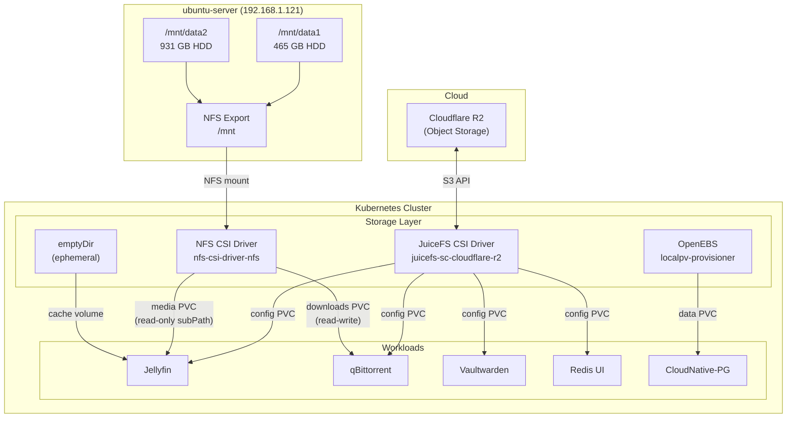
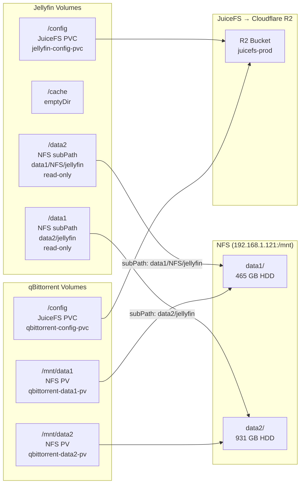

# Home Lab Infrastructure

> *"Move fast and break things"* -- Mark Zuckerberg
> *"I moved fast. Things are broken."* -- Me, at 3 AM

Private infrastructure repository managing a single-node Proxmox environment that somehow runs production services, a Kubernetes cluster held together by optimism, and more YAML than any human should write in one lifetime.

**Domain:** `datrollout.dev`

---

## Table of Contents

- [Architecture Overview](#architecture-overview)
- [Hardware](#hardware)
- [Network Topology](#network-topology)
- [Compute Inventory](#compute-inventory)
- [Platform Tooling](#platform-tooling)
- [Deployed Services](#deployed-services)
- [The Kubernetes Situation](#the-kubernetes-situation)
- [Storage Architecture](#storage-architecture)
- [Security](#security)
- [Observability](#observability)
- [Backup and Disaster Recovery](#backup-and-disaster-recovery)
- [CI/CD](#cicd)
- [Repository Structure](#repository-structure)
- [Getting Started](#getting-started)

---

## Architecture Overview

The infrastructure follows a hybrid model in active transition: services are being migrated from Docker on ubuntu-server to Kubernetes, starting with internal tools. Kubernetes is no longer just a lab — it is increasingly the primary runtime, while Docker remains the fallback for anything not yet migrated.

```
                         Internet
                            |
                      "please be gentle"
                            |
                            v
                  +-------------------+
                  |    Cloudflare     |
                  | DNS / WAF / Proxy |
                  |  "the bodyguard"  |
                  +---------+---------+
                            |
                            v
+---------------------------------------------------------------+
|                   Proxmox VE (pve-master)                     |
|                     192.168.1.120                              |
|              One node to rule them all.                        |
|                                                                |
|  PRODUCTION (the stuff that must not go down)                  |
|  +---------------------------+  +---------------------------+  |
|  | ubuntu-server  .1.121     |  | hephaestus     .1.124     |  |
|  | Traefik, Docker services  |  | GitLab Runner, GH Runner  |  |
|  | Monitoring stack          |  | Named after a Greek god   |  |
|  | (the workhorse)           |  | (for extra cool points)   |  |
|  +---------------------------+  +---------------------------+  |
|  +---------------------------+  +---------------------------+  |
|  | vpn-server     .1.123     |  | sonarqube      .1.125     |  |
|  | OpenVPN + OTP             |  | "yes I lint my homelab"   |  |
|  +---------------------------+  +---------------------------+  |
|  +---------------------------+                                 |
|  | teleport       .1.122     |                                 |
|  | Zero-Trust Access         |                                 |
|  | (SSH but make it fancy)   |                                 |
|  +---------------------------+                                 |
|                                                                |
|  Production LXC                                                |
|  +---------------------------+  +---------------------------+  |
|  | postgresql-16  .99.2      |  | crowdsec       .1.127     |  |
|  | The elephant in the room  |  | "you shall not pass"      |  |
|  +---------------------------+  +---------------------------+  |
|                                                                |
|  Kubernetes Cluster (MIGRATION IN PROGRESS)                   |
|  +----------------------------------------------------------+ |
|  | Masters: .1.180-.182 (x3)  Workers: .1.190-.193 (x4)     | |
|  | ArgoCD, Traefik, MetalLB, OpenEBS, CloudNative-PG,       | |
|  | Velero, kube-prometheus-stack, Strimzi Kafka, Redis,     | |
|  | qBittorrent, Jellyfin (migrated from Docker)              | |
||  |                                                            | |
|  | "One day this will replace everything above.               | |
|  |  That day has started."                                   | |
|  +----------------------------------------------------------+ |
+---------------------------------------------------------------+
```

Traffic flow for public-facing services:

```
Client -> Cloudflare (proxy/WAF) -> Traefik (reverse proxy) -> CrowdSec (middleware) -> Service
                                                                     |
                                                              "papers, please"
```

---

## Hardware

One server. Everything runs on one server. Yes, the "cluster" too. No, it's not HA. Yes, I know.

| Component      | Specification                          | Notes                              |
|----------------|----------------------------------------|------------------------------------|
| CPU            | 2x Intel Xeon E5-2680 v4 (56 threads) | Slightly aged but still kicking    |
| Memory         | 62 GB DDR4                             | Enough for K8s. Barely.            |
| Boot/VM disk   | 1.8 TB NVMe                            | The fast one. VMs live here.       |
| Data (HDD)     | 465 GB + 931 GB SATA                   | Spinning rust from a previous era  |
| Hypervisor     | Proxmox VE                             | The backbone of this operation     |
| Electricity    | Yes                                    | I don't talk about this           |

---

## Network Topology

| Network              | Subnet             | Purpose                              |
|----------------------|---------------------|--------------------------------------|
| LAN                  | 192.168.1.0/24     | Primary network for all VMs and LXCs |
| Private              | 192.168.99.0/24    | Isolated network for stateful services -- cannot be reached from the outside, which is the whole point |
| Docker internal      | 192.168.30.0/24    | Bridge network for Docker containers on ubuntu-server |
| MetalLB pool         | 192.168.1.230-240  | Kubernetes LoadBalancer IP range     |

DNS is managed via Cloudflare and Terraform.
**Public DNS (proxied CNAME via Cloudflare):**

| Record                          | Type  | Proxied | Target        |
|---------------------------------|-------|---------|---------------|
| nextcloud.datrollout.dev        | CNAME | Yes     | DDNS endpoint |
| gitlab.datrollout.dev           | CNAME | Yes     | DDNS endpoint |
| bitwarden.datrollout.dev        | CNAME | Yes     | DDNS endpoint |
| sonarqube.datrollout.dev        | CNAME | Yes     | DDNS endpoint |
| loki.datrollout.dev             | CNAME | Yes     | DDNS endpoint |
| prometheus.datrollout.dev       | CNAME | Yes     | DDNS endpoint |
| grafana.datrollout.dev          | CNAME | Yes     | DDNS endpoint |

**Internal DNS (unproxied A records pointing to K8s Traefik at `192.168.1.232`):**

| Record                          | Type | Proxied | Target          |
|---------------------------------|------|---------|-----------------|
| core-harbor.datrollout.dev      | A    | No      | 192.168.1.232   |
| kafka-ui.datrollout.dev         | A    | No      | 192.168.1.232   |
| pgadmin4.datrollout.dev         | A    | No      | 192.168.1.232   |
| argocd.datrollout.dev           | A    | No      | 192.168.1.232   |
| jellyfin.datrollout.dev         | A    | No      | 192.168.1.232   |
| qbittorrent.datrollout.dev      | A    | No      | 192.168.1.232   |

Internal records resolve to the Kubernetes Traefik ingress (via MetalLB) and are only reachable from the local network or VPN.

---

## Compute Inventory

### Virtual Machines

| Host           | IP             | OS           | vCPU | RAM   | Role                                 |
|----------------|----------------|--------------|------|-------|--------------------------------------|
| pve-master     | 192.168.1.120  | Proxmox VE   | --   | --    | Hypervisor (the boss)                |
| ubuntu-server  | 192.168.1.121  | Ubuntu 22.04 | 4    | 16 GB | Docker host, Traefik, monitoring (the workhorse) |
| teleport       | 192.168.1.122  | --           | --   | --    | Zero-trust access proxy              |
| vpn-server     | 192.168.1.123  | Debian 13    | 1    | 2 GB  | OpenVPN with OTP (for remote chaos)  |
| hephaestus     | 192.168.1.124  | Ubuntu 22.04 | 4    | 16 GB | CI/CD runners (GitLab + GitHub)      |
| sonarqube      | 192.168.1.125  | Ubuntu 22.04 | 4    | 8 GB  | SonarQube -- yes, I run static analysis on my homelab code |

### LXC Containers

| Host                    | IP             | OS           | vCPU | RAM  | Role                      |
|-------------------------|----------------|--------------|------|------|---------------------------|
| postgresql-16           | 192.168.99.2   | Ubuntu 22.04 | 1    | 2 GB | PostgreSQL 16 (production)|
| crowdsec-detection      | 192.168.1.127  | Ubuntu 22.04 | 1    | 1 GB | CrowdSec LAPI + AppSec   |

### Kubernetes Cluster (Dev/Exploration)

Deployed via Kubespray. Seven VMs pretending to be a datacenter. See [The Kubernetes Situation](#the-kubernetes-situation) for the full story.

| Role    | Count | IP Range            | vCPU | RAM  | Disk   |
|---------|-------|---------------------|------|------|--------|
| Master  | 3     | 192.168.1.180-182   | 2    | 4 GB | 50 GB  |
| Worker  | 4     | 192.168.1.190-193   | 4    | 5 GB | 100 GB |

---

## Platform Tooling

### Terraform

All infrastructure provisioning is managed through Terraform with reusable modules from a separate [terraform-module](https://github.com/ngodat0103/terraform-module) repository. Because copy-pasting HCL blocks is for people who haven't been hurt enough yet.

| Configuration           | Provider                  | Purpose                                       |
|-------------------------|---------------------------|-----------------------------------------------|
| `tf/proxmox`            | bpg/proxmox 0.92.0       | VMs, LXCs, networks, cloud-init images        |
| `tf/cloudflare/dns`     | cloudflare/cloudflare ~5  | DNS records, WAF firewall rules               |
| `tf/cloudflare/storage` | cloudflare/cloudflare     | R2 object storage (Velero backend)            |
| `tf/uptimerobot`        | vexxhost/uptimerobot      | External uptime monitoring (the 3 AM alarm)   |

### Ansible

Server configuration and application deployment for all non-Kubernetes workloads. The production stuff. The things that actually matter.

| Playbook Area                | Purpose                                               |
|------------------------------|-------------------------------------------------------|
| `ansible/core/ubuntu-server` | Docker host setup, app deployment, monitoring, cron   |
| `ansible/core/hephaestus`    | CI runner provisioning (Go, Maven, Docker, kubectl)   |
| `ansible/core/teleport`      | Teleport access proxy installation                    |
| `ansible/core/vpn-server`    | OpenVPN server with OTP                               |
| `ansible/core/lxc`           | PostgreSQL and Kafka configuration                    |
| `ansible/sonarqube`          | SonarQube installation                                |
| `ansible/kubernetes`          | Kubespray inventory and cluster configuration         |

### ArgoCD (Kubernetes)

GitOps deployment using the app-of-apps pattern. ArgoCD is installed via Helm and manages all cluster workloads. It's ArgoCD all the way down.

| Category   | Applications                                                                      |
|------------|-----------------------------------------------------------------------------------|
| Daemon     | MetalLB, kube-prometheus-stack                                                    |
| Stateful   | CloudNative-PG (PostgreSQL), Redis, Chaos Mesh, qBittorrent, Jellyfin             |
| Stateless  | Traefik, Vaultwarden, Sealed Secrets, Metrics Server                              |
| Operators  | Strimzi Kafka Operator, MongoDB Operator (disabled)                               |
| Storage    | OpenEBS (localpv-provisioner), Velero, JuiceFS (Cloudflare R2), NFS CSI Driver   |

---

## Deployed Services

### Production (Docker on ubuntu-server)

The remaining Docker services — to be migrated to Kubernetes as the cluster stabilises. Internal tools are being moved first.

| Service       | Purpose                  | Exposed Domain              | Status        |
|---------------|--------------------------|-----------------------------|---------------|
| GitLab        | Source control and CI/CD | gitlab.datrollout.dev       | Docker        |
| Vaultwarden   | Password management      | bitwarden.datrollout.dev    | Docker        |
| Nextcloud     | File synchronization     | nextcloud.datrollout.dev    | Docker        |
| Jellyfin      | Media server             | jellyfin.datrollout.dev     | **Migrated → K8s** |
| qBittorrent   | Torrent client           | qbittorrent.datrollout.dev  | **Migrated → K8s** |

### Production (Standalone)

| Service       | Host             | Purpose                           |
|---------------|------------------|-----------------------------------|
| PostgreSQL 16 | 192.168.99.2     | Primary relational database       |
| CrowdSec      | 192.168.1.127    | Web application firewall / IDS    |
| SonarQube     | 192.168.1.125    | Static code analysis              |
| Teleport      | 192.168.1.122    | Zero-trust infrastructure access  |
| OpenVPN       | 192.168.1.123    | Remote VPN access with OTP        |

### Kubernetes Cluster (Dev/Exploration)

| Application             | Namespace              | Chart Version | Source                    |
|-------------------------|------------------------|---------------|---------------------------|
| ArgoCD                  | argocd                 | 9.4.15        | argoproj/argo-helm        |
| Traefik                 | traefik                | 37.4.0        | traefik/charts            |
| MetalLB                 | metallb                | 0.15.2        | metallb/metallb           |
| OpenEBS                 | openebs                | 4.3.3         | openebs/openebs           |
| CloudNative-PG          | prod-postgresql        | 0.25.0        | cloudnative-pg            |
| Velero                  | velero                 | 12.0.0        | vmware-tanzu/velero       |
| kube-prometheus-stack   | kube-prometheus-stack  | 82.13.0       | prometheus-community      |
| Strimzi Kafka Operator  | kafka                  | 0.50.0        | strimzi                   |
| Sealed Secrets          | sealed-secrets         | 2.17.2        | bitnami-labs              |
| Vaultwarden             | vaultwarden            | 0.32.1        | guerzon/vaultwarden       |
| Redis                   | redis                  | 0.16.5        | ot-container-kit          |
| Chaos Mesh              | chaos-mesh             | 2.8.0         | chaos-mesh                |
| Metrics Server          | metrics-server         | 3.13.0        | metrics-server            |
| JuiceFS CSI Driver      | juicefs                | 0.31.4        | wener/juicefs-csi-driver  |
| NFS CSI Driver          | kube-system            | v4.13.2       | kubernetes-csi/csi-driver-nfs |
| **qBittorrent**         | qbittorrent            | --            | raw manifests (migrated)  |
| **Jellyfin**            | jellyfin               | --            | raw manifests (migrated)  |

CloudNative-PG manages databases for: `nextcloud`, `gitlabhq_production`, `vaultwarden`.

---

## The Kubernetes Situation

The migration has started. Here is the honest state of affairs.

The Kubernetes cluster started as a **dev and exploration environment**. Production ran on Docker + Ansible on ubuntu-server because it worked and I slept at night. That model is now actively being dismantled.

Every service on the Docker side requires writing Ansible playbooks, Docker Compose files, systemd units, Traefik labels, Prometheus scrape configs, backup cron jobs, and update procedures — **per service, by hand, every single time**. It's the YAML equivalent of digging a ditch with a spoon. Kubernetes solves this: define it once, let ArgoCD sync it, let the platform handle scheduling, networking, storage, secrets, and rollbacks. The app-of-apps pattern already proves the point — enabling a full service stack is a boolean flip in `values.yaml`.

**Migration strategy: internal tools first.**

Internal-facing services (no public exposure, no user-facing SLA) are migrated first to build confidence in the cluster before touching anything critical.

| Wave | Services | Status |
|------|----------|--------|
| 1 — Internal tools | qBittorrent, Jellyfin | **Done** |
| 2 — Self-hosted productivity | Nextcloud, Vaultwarden | Planned |
| 3 — Critical infrastructure | GitLab | Last |

**Storage approach for migrated services:**
- Config / state → JuiceFS backed by Cloudflare R2 (survives node loss)
- Media / large data → NFS PV pointing at existing disks on ubuntu-server
- Ephemeral cache → `emptyDir`

**The plan:**

1. ~~Keep exploring and stabilizing the K8s environment~~ — done, it runs workloads
2. ~~Prove it can run workloads reliably~~ — qBittorrent and Jellyfin are live
3. Continue migrating internal tools wave by wave
4. When budget allows, build a proper multi-node cluster with dedicated hardware
5. Eventually decommission ubuntu-server as a Docker host entirely

The cluster now runs production workloads.
---

## Storage Architecture

Three storage tiers are in use — cloud object storage for durable config/state, local NFS for bulk media, and ephemeral node-local storage for throwaway cache.

### Overall Storage Topology



### Per-Workload Storage Mapping



### Storage Tier Summary

| Tier | Technology | Backend | Use Case | Durability |
|------|-----------|---------|----------|------------|
| Cloud-backed config | JuiceFS CSI | Cloudflare R2 | App config, state | Survives node/disk loss |
| Local NFS | NFS CSI Driver | ubuntu-server `/mnt` | Media files, torrent downloads | Single-host (NAS) |
| Ephemeral | `emptyDir` | Node disk | Transcoding cache | Lost on pod restart |
| Local block | OpenEBS localpv | Worker node disk | PostgreSQL data | Single-node |

---

## Security

Traffic goes through multiple layers before it reaches anything useful. I'd rather explain downtime than a breach.

### Edge Protection (Cloudflare)

- All public traffic is proxied through Cloudflare
- Geo-blocking: only traffic originating from Vietnam is permitted (sorry, rest of the world)
- UptimeRobot health check IPs are explicitly whitelisted
- Vaultwarden `/admin` endpoint is blocked at the edge, because even I don't trust myself with that URL exposed

### Reverse Proxy (Traefik v3)

- TLS termination via Let's Encrypt using Cloudflare DNS-01 challenge
- All requests pass through CrowdSec bouncer middleware -- every single one
- Real client IPs extracted from `CF-Connecting-IP` header
- Prometheus metrics and structured access logging enabled

### Kubernetes Internal Ingress Policy

Internal-only applications in the Kubernetes lab stay behind Traefik and are restricted with an IP allowlist middleware.

- Internal-only apps: `sonarqube`, `juicefs`, `grafana`, `alertmanager`, `pgadmin4`, `chaos-mesh`
- Harbor follows the same policy when enabled
- Required ingress annotations for internal apps:
  - `traefik.ingress.kubernetes.io/router.entrypoints: "websecure"`
  - `traefik.ingress.kubernetes.io/router.middlewares: "traefik-allow-local-ip-only@kubernetescrd"`
- Allowed LAN/VPN CIDRs are managed in:
  - `kubernetes/argocd/argocd-app/stateless/traefik/middlewares/allow-local-ip-only.yaml`
- Public apps must not use the local-only middleware

### Intrusion Detection (CrowdSec)

- LAPI running on port 8080, AppSec engine on port 7422
- Detection scenarios: HTTP path traversal, XSS probing, generic brute force
- Operating mode: live (real-time blocking, not just logging and hoping)
- Failure behavior: **block all traffic** if CrowdSec becomes unreachable

```yaml
crowdsecAppsecUnreachableBlock: true
crowdsecAppsecFailureBlock: true
# Translation: "I'd rather the site be down than compromised"
```

### Access Management

| Tool       | Purpose                                        |
|------------|------------------------------------------------|
| Teleport   | Zero-trust access to SSH and internal services |
| OpenVPN    | Remote network access with OTP                 |

### Secret Management

| Method          | Scope                                  |
|-----------------|----------------------------------------|
| Ansible Vault   | Infrastructure credentials             |
| Sealed Secrets  | Kubernetes secrets committed to Git    |

---

## Repository Structure

```
.
├── ansible/
│   ├── core/                          # Production server configuration (the real stuff)
│   │   ├── inventory.ini              # Ansible inventory (all hosts)
│   │   ├── ubuntu-server/             # Docker host: apps, basic setup, monitoring, cron
│   │   ├── hephaestus/                # CI/CD runner provisioning
│   │   ├── teleport/                  # Zero-trust access proxy
│   │   ├── vpn-server/                # OpenVPN configuration
│   │   └── lxc/                       # LXC workloads (PostgreSQL, Kafka)
│   ├── kubernetes/                    # Kubespray inventory and configuration
│   ├── sonarqube/                     # SonarQube installation playbook
│   └── proxmox/                       # Proxmox host configuration
│
├── kubernetes/                        # Dev/exploration environment
│   ├── argocd/
│   │   ├── argocd-crd/                # ArgoCD installation (Helm)
│   │   ├── app-of-app/                # App-of-apps Helm chart (values.yaml toggles)
│   │   └── argocd-app/                # Per-application ArgoCD manifests and values
│   │       ├── daemon/                # MetalLB, kube-prometheus-stack
│   │       ├── stateful/              # PostgreSQL, Redis, Chaos Mesh, local-path
│   │       └── stateless/             # Traefik, Vaultwarden, Sealed Secrets, metrics-server
│   └── charts/                        # Custom Helm charts (Kafka operator, Mongo operator)
│
├── tf/
│   ├── proxmox/                       # VM/LXC provisioning, network, cloud-init
│   ├── cloudflare/
│   │   ├── dns/                       # DNS records and WAF firewall rules
│   │   └── storage/                   # R2 bucket for Velero
│   ├── uptimerobot/                   # External uptime monitors
│   └── terraform-module/              # Shared Terraform modules (submodule)
│
├── disaster-recovery/
│   └── vaultwarden/                   # Backup and restore scripts (the most important directory)
│
└── plans/                             # Architecture decision records and future plans
```

---
## License

This project is licensed under the "Works On My Machine" license.

You're free to:
- Copy this and break your own stuff
- Learn from my mistakes
- Judge my configuration choices
- Wonder why anyone runs Chaos Mesh at home

---

*Powered by caffeine, spite, and 56 Xeon threads that could heat a small apartment.*
